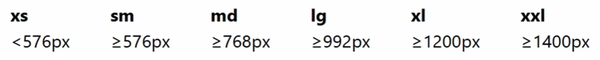
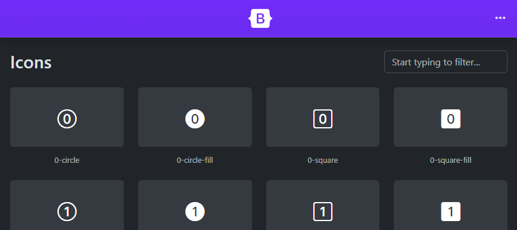
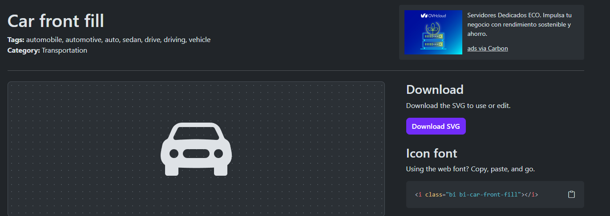

# Introducción a Bootstrap

Toda la documentación está disponible en https://getbootstrap.com/

La versión con la que se han realizado estos apuntes y ejemplos es la 5.3 y su documentación oficial está aquí: https://getbootstrap.com/docs/5.3/getting-started/introduction/

## Como añadir Bootstrap a un proyecto

Simplemente con añadir las siguientes líneas al \<head\> de nuestro proyecto será suficiente:

```html
    <!-- Bootstrap CSS -->
    <link href="https://cdn.jsdelivr.net/npm/bootstrap@5.3.2/dist/css/bootstrap.min.css" rel="stylesheet"
        integrity="sha384-T3c6CoIi6uLrA9TneNEoa7RxnatzjcDSCmG1MXxSR1GAsXEV/Dwwykc2MPK8M2HN" crossorigin="anonymous">
    <script src="https://cdn.jsdelivr.net/npm/bootstrap@5.3.2/dist/js/bootstrap.bundle.min.js"
        integrity="sha384-C6RzsynM9kWDrMNeT87bh95OGNyZPhcTNXj1NW7RuBCsyN/o0jlpcV8Qyq46cDfL"
        crossorigin="anonymous"></script>

```

Esto hará que el desde el cliente al ejecutar nuestra web se descarguen automáticamente las dependencias de Bootstrap, para la versión ahí especificada, en este caso es la 5.2.2.


## El Grid

Nos va a permitir estructurar los elementos de la web y como van a adaptarse los elementos de la web.

El Grid es una cuadrícula imaginaria que nos va a permitir definir cómo queremos que se presenten los elementos de la web y qué espacio van a ocupar. La grid de Bootstrap es un conjunto de contenedores, filas y columnas que definen cómo se va a presentar y alinear el contenido.

La cuadrícula nos va a permitir trabajar por filas y columnas, pero cada fila está dividida en 12 columnas. Esto quiere decir que podemos indicar cuántas columnas queremos que ocupe cada elemento en una fila, hasta un máximo de 12 (entre todos los elementos de la fila).

### Clases para la Grid

* .row : Al agregar la clase row estamos diciendo que el elemento que contenga esta clase será tratado como una fila. 
* .col- : La clase col nos dice cuántas columnas va a ocupar en la fila este elemento (entre 0 y 12). Tamaño de columna extra pequeña, por defento.
* .col-xs- : Tamaño de columna extra pequeña
* .col-sm- : Tamañod e columna pequeña
* .col-md- : Tamaño de columna mediana
* .col-ls- : Tamaño de columna grande
* .col-xl- : Tamaño de columna extra grande
* .col-xxl- : Tamaño de columna extra extra grande




### Breakpoints en Bootstrap

Dimensión (ancho) a partir de la cuál podemos cambiar el estilo o la estructura de la web. Esto se refiere a los tamaños de pantalla en los que cambiamos de "tipo" de pantalla para aplicar un cambio de tamaño u ocultar o mostrar algún elemento y ayudar a la responsividad del sitio.

### Estructura de la Grid

Un contenedor (container), como ya adelantábamos, puede contener filas y cada fila contiene 12 columnas. 

Una estructura simple podría ser algo así:

```html
<div class="container">
    <div class="row">
        <div class = "col"></div>
        <div class = "col"></div>
    </div>
    <div class="row">
        <div class = "col"></div>
        <div class = "col"></div>
        <div class = "col"></div>
    </div>
</div>
```

[Ejemplo con código](filas_y_columnas.html)

Un container en bootstrap es un elemento html que va a contener toda la estructura de filas y columnas, tenemos dos clases específicas para crear estos contenedores:

* .container : Esta clase crea un contenedor responsivo con un ancho máximo fijo que depende del tamaño del dispositivo
* .coontainer-fluid : Esta clase crea un contenedor respnosivo que cubre el 100% del ancho de la ventana. 

```html
    <div class="container">
        .container
    </div>
    <div class="container-fluid">
        .container-fluid
    </div>
```

En Bootstrap, se pueden asignar los siguientes tamaños a un container:

* .container-sm: Tamaño pequeño.
* .container-md: Tamaño mediano.
* .container-lg: Tamaño grande.
* .container-xl: Tamaño extra grande.
* .container-xxl: Tamaño extra extra grande.

[Ejemplo con código](containers.html)

Estas clases se pueden utilizar para crear contenedores responsivos con diferentes anchos máximos dependiendo del tamaño del dispositivo.

En los anchos de pantalla en los que pueden expandirse, los contenedores van a comportarse como un container-fluid, en el momento en el que llegan a su breakpoint, vuelven a comportarse como un container normal.

#### Filas y columnas

Los elementos html pueden ocupar una o varias columnas, siempre dentro de las 12 máximas de la fila, pero repartiendo dichas columnas como queremos repartir el ancho de la misma. 

Las columnas de los elementos de una fila siempre deben sumar 12 para que estén ubicadas en una misma línea, si sumamos más de las 12, el excedente se irá a una nueva línea.

La cantidad de filas y columnas que pueden ocupar puede que no queramos que sea la misma en todos los tamaños de pantalla, para ello, podemos asignar diferentes cantidades dentro de las posibles 12 columnas según el tamaño, en el ejemplo siguiente vemos dos elementos que ocupan 4 y 8 columnas para tamaños pequeños y 6 y 6 para tamaños grandes respectivamente:

```html
        <div class="row">
            <div class = "col-sm-4 col-lg-6">
                .col-sm-4 .col-lg-6
            </div>
            <div class = "col-sm-8 col-lg-6">
                .col-sm-8 -col-lg-6
            </div>
        </div>
```

[Ejemplo con código](grid_con_breakpoints.html)


## Los Componentes

Elementos HTML reutilizables con un estilo ya predeterminado. Además, también podremos personalizar ese estilo ya predeterminado completamente a nuestro gusto.

Toda la información sobre los distintos componentes incluídos con Bootstrap podemos encontrarla en la documentación oficial, junto con ejemplos de uso interactivos. 

Todos los componenentes pueden personalizarse, la gran mayoría no necesitan de código JavaScript para hacerlo, pero hay algunos que si. 

[Ejemplo con código](components.html)

## Los iconos

Iconos gratuitos que podemos utilizar en nuestras webs, por ejemplo, iconos de las RRSS más utilizadas. 

Los iconos de bootstrap también son adaptativos, por lo que no hay que preocuparse por como se verán en una pantalla más o menos grandes, al igual que los componentes, son responsivos. 

Al igual que los componentes, también podemos encontrar toda la información sobre el uso de estos iconos en la documentación de Bootstrap. Es una librería de iconos SVG bastante amplia, con más de 1500 a fecha de la creación de estos apuntes.

En la página oficial encontraremos un apartado para los iconos en https://icons.getbootstrap.com/ donde podremos usar su buscador para encontrar los que necesitemos.



Cuándo encontremos un icono que queramos añadir a nuestra web, podemos o bien, descarga el archivo SVG para incluirlo en los recursos de nuestra web o, si estamos utilizando Bootstrap, también podemos incluir la línea de código que nos muestra debajo de la opción de descargar dicho icono para no tener que llenar nuestro proyecto con imágenes y dejar que bootstrap se encargue de descargarlas en el cliente cuándo ejecute nuestra web:



En este caso, tan solo tendríamos que añadir la siguiente línea de código:

```html
<i class="bi bi-car-front-fill"></i>
```

> **Nota:** Sin embargo, no son los mismos enlaces de Bootstrap que hemos utilizado para los componentes u otros elementos los que necesitamos para los iconos, para poder añadir iconos y que sean visibles, debemos de tener añadido bootstrap icons en nuestro \<head>

Hay varias formas de incluir Bootstrap icons en nuestro proyecto, al igual que ocurre con las librerías anteriores, nosotros veremos la forma de incluirlo mediante CDN, añadiendo la siguiente línea a nuestro \<head>:
```html
<link rel="stylesheet" href="https://cdn.jsdelivr.net/npm/bootstrap-icons@1.11.3/font/bootstrap-icons.min.css">
```

Aunque, si no tenemos bootstrap añadido, también podemos pegar el código SVG de como se genera la imagen en nuestro html, para poder añadir el icono sin descargar la imagen ni depender de tener bootstrap añadido al proyuecto. El código SVG también está disponible en la documentación de cada icono. 

```html
<svg xmlns="http://www.w3.org/2000/svg" width="16" height="16" fill="currentColor" class="bi bi-car-front-fill" viewBox="0 0 16 16">
  <path d="M2.52 3.515A2.5 2.5 0 0 1 4.82 2h6.362c1 0 1.904.596 2.298 1.515l.792 1.848c.075.175.21.319.38.404.5.25.855.715.965 1.262l.335 1.679q.05.242.049.49v.413c0 .814-.39 1.543-1 1.997V13.5a.5.5 0 0 1-.5.5h-2a.5.5 0 0 1-.5-.5v-1.338c-1.292.048-2.745.088-4 .088s-2.708-.04-4-.088V13.5a.5.5 0 0 1-.5.5h-2a.5.5 0 0 1-.5-.5v-1.892c-.61-.454-1-1.183-1-1.997v-.413a2.5 2.5 0 0 1 .049-.49l.335-1.68c.11-.546.465-1.012.964-1.261a.8.8 0 0 0 .381-.404l.792-1.848ZM3 10a1 1 0 1 0 0-2 1 1 0 0 0 0 2m10 0a1 1 0 1 0 0-2 1 1 0 0 0 0 2M6 8a1 1 0 0 0 0 2h4a1 1 0 1 0 0-2zM2.906 5.189a.51.51 0 0 0 .497.731c.91-.073 3.35-.17 4.597-.17s3.688.097 4.597.17a.51.51 0 0 0 .497-.731l-.956-1.913A.5.5 0 0 0 11.691 3H4.309a.5.5 0 0 0-.447.276L2.906 5.19Z"/>
</svg>
```

Al ser imágenes SVG, podemos también importar los iconos dentro de etiquetas img, por ejemplo:

```html

```

Es importante tener en cuenta que los iconos son tratados como texto por Bootstrap en su etiqueta \<i>, y al ser imágenes SVG, podemos modificar detalles como su tamaño o color tal y como si fuesen texto a través de CSS. 

Por ejemplo, así incluímos el icono del coche:

```html
    <i class="bi bi-car-front-fill"></i>
```

Y así poodemos poner el coche más grande y en rojo, con CSS:

```css
    i {
        font-size: 50px;
        color: red;
    }
```

[Ejemplo con código](icons.html)

## El Flexbox (CSS Flexible Box Layout)

Flexbox nos permite que los elementos resposive ubicados dentro de un contenedor se distribuyan automáticamente en base al tamaño del dispositivo.

Un ejemplo sencillo de aplicación de flexbox con HTML y CSS sería el siguiente:

```html
    <div class="contenedor">
        Contenedor flex
    </div>
```

```css
    .contenedor {
        display: flex;
    }
```

Bootstrap nos incluye clases que podemos usar para trabajar con flexbox de una forma más sencilla.

Si solo queremos añadir las propiedades de flex a ciertos elementos nos es tan sencillo como añadir la clase flex a nuestros contenedores que queramos que sean flex:

```html
    <div class="d-flex">
        Contenedor flex
    </div>
```

### Principales propiedades CSS con las que trabajar con Flexbox

* flex-direction : Esta propiedad establece el eje principal del contenedor, la dirección en la cuál se van a colocar los elementos dentro del contenedor. Haciéndo así que el restos e alineen de forma vertical u horizontal.

    * row : Los elementos se posicionan en horizontal de izquierda a derecha.
    * row-reverse : Los elementos se posicionan en horizontal de derecha a izquierda
    * column :  Los elementos se posicionan en vertical de arriba a abajo.
    * column-reverse : Los elementos se posicionan en vertial de abajo a arriba.

* justify-content : Define cómo se distribuyen los elementos en el eje principal (anteriormente definido con flex-direction). Los posibles valores son los siguientes y sus respectivas clases en Bootstrap para trabajar con estos valores:
    * flex-start : .justify-content-start
    * flex-end : .justify-content-end
    * center : .justify-content-center
    * space-between : .justify-content-between
    * space-around : .justify-content-around
    * space-evenly : .justify-content-evenly

* align-items : Define cómo se distribuyen los elementos en el eje perpendicular al eje principal, es decir, el eje contrario al que hemos definido en el flex-direction. Sus posibles valores, junto con las clases correspondientes de Bootstrap son:
    * flex-start : .align-items-start
    * flex-end : .align-items-end
    * center : .align-items-center
    * baseline : .align-items-baseline
    * stretch : .align-items-stretch

* flex-wrap : Determina si los elementos deben ajustarse para que estén siempre en una misma línea o si se les permite distribuirse en varias líneas si es necesario, por ejemplo, en caso de que cambie el ancho de la pantalla. Los posibles valores que puede tomar esta propiedad y sus clases correspondientes en Bootstrap son las siguientes:
    * nowrap (valor por defecto) : .flex.nowrap
    * wrap : .flex-wrap
    * wrap-reverse : .flex-wrap-reverse


